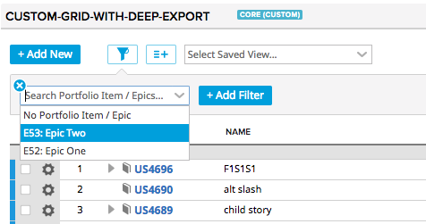

# @agile-central-technical-services/utils-ancestor-pi-inline-filter

Overrides that adds a ancestor portfolio item filter to the `rallygridboardinlinefiltercontrol`
for each portfolio item type supplied to the `quickFilterPanelConfig`.

The plugin will:
* add a filter field for each portfolio level into the quick filter chooser
* render that field as a artifact search combobox quick filter
* apply the quick filter to the current advanced filters



## Installation
1. Install using npm (or yarn) `npm install '@agile-central-technical-services/utils-ancestor-pi-inline-filter' -D`
2. Add the file to the `javascript` section of `config.json`
    ```
     "javascript": [
        "node_modules/@agile-central-technical-services/utils-ancestor-pi-inline-filter/index.js",
        ...
    ```
## Example usage

```
    addGridboard: function() {
        this.add({
            xtype: 'rallygridboard',
            modelNames: this.modelNames,
            plugins: [
                {
                    ptype: 'rallygridboardinlinefiltercontrol',
                    inlineFilterButtonConfig: {
                        stateful: true,
                        stateId: this.getContext().getScopedStateId('filters-1'),
                        modelNames: this.modelNames,
                        inlineFilterPanelConfig: {
                            quickFilterPanelConfig: {
                                portfolioItemTypes: this.portfolioItemTypes,
                                modelName: this.modelNames[0],
                                whiteListFields: [
                                   'Tags',
                                   'Milestones'
                                ]
                            }
                        }
                    }
                }
            ...
    }
```

## Developer Notes
To Update
1. `npm version patch` - This will update the package.json to a new version and create a git tag (e.g. `v1.0.1`). It will also run the `postversion` script
to push the changes and tag to GitHub.
2. `npm publish --access public` - This will publish the new version to npmjs.org
3. Create the new release in [`utils-ancestor-pi-inline-filter/releases'](https://github.com/RallyTechServices/utils-ancestor-pi-inline-filter/releases)

